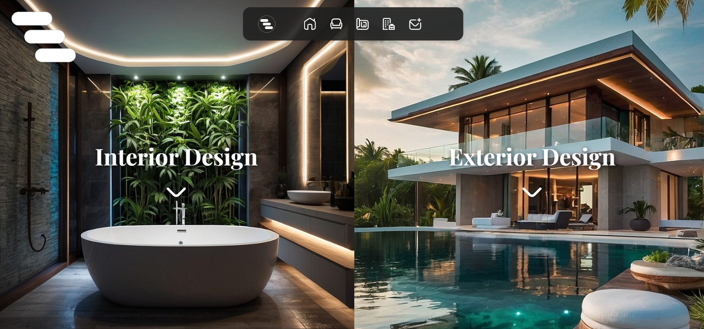

<h1 align="center">🏗️ Visualization.gr</h1>

  A modern, responsive, and visually captivating website designed for an architectural firm. Built with <strong>React</strong>, this platform elegantly showcases architectural projects, offering an immersive and seamless user experience.

---

<h2>✨ Features</h2>

<ul>
  <li><strong>Modern & Minimalist Design:</strong> A clean, professional, and aesthetically pleasing interface that enhances architectural storytelling.</li>
  <li><strong>Fully Responsive:</strong> Optimized for desktops, tablets, and mobile devices, ensuring a seamless browsing experience.</li>
  <li><strong>Interactive Project Showcase:</strong> High-quality images with smooth transitions, detailed project descriptions, and an engaging visual layout.</li>
  <li><strong>Fast & Optimized Performance:</strong> Built with lightweight technologies to ensure fast load times and smooth rendering.</li>
  <li><strong>Intuitive Navigation:</strong> A well-structured layout with easy-to-use menus and fluid page transitions.</li>
  <li><strong>Subtle Animations:</strong> Engaging hover effects and interactive elements that enhance user experience.</li>
</ul>

---

<h2>🛠️ Technologies Used</h2>

<ul>
  <li><strong>React + Vite:</strong> Ensuring high performance and rapid development.</li>
  <li><strong>CSS:</strong> Custom styling with a focus on clean and elegant aesthetics.</li>
  <li><strong>Firebase Hosting:</strong> Reliable and secure deployment for seamless access.</li>
</ul>

---

<h2>🔗 Live Website</h2>

Visit the live website: <a href="https://visualization.gr" target="_blank"><strong>Visualization.gr</strong></a>

---

<h2>📂 Folder Structure</h2>

<pre>
src/
├── assets/          # Images, icons, and static files
├── components/      # Reusable React components (Navbar, ProjectCards, etc.)
├── styles/          # CSS files for styling components
├── App.js           # Main app component
└── main.jsx         # Entry point for the React application
</pre>

---

<h2>📸 Screenshots</h2>

  
   

---

<h2>📜 License</h2>

  This project is licensed under the <a href="LICENSE">MIT License</a>.

---

<h2>📧 Contact</h2>

  Have feedback or suggestions? Feel free to connect on <a href="https://www.linkedin.com/">LinkedIn</a> or reach out via email! 🚀

